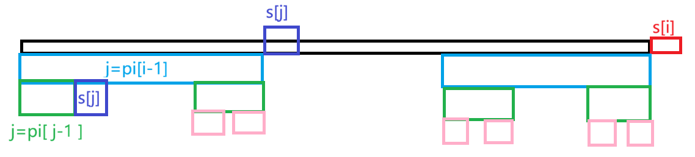

- # **题目链接：**

[子串匹配_牛客题霸_牛客网](https://www.nowcoder.com/practice/70a543d8a9a445c1a2543bbdfc9f2dde?channelPut=tracker2)

- # **题目描述：**

给定文本串 \(S_1\) 和模式串 \(S_2\)，若存在下标 \(l\ (1 \le l \le |S_1| - |S_2| + 1)\) 使得 \(S_1[l\dots l+|S_2|-1] = S_2\)，则称 \(S_2\) 在 \(S_1\) 中出现，出现位置为 l（下标从 1 开始）。

你的任务包括两部分：

- 输出 \(S_2\) 在 \(S_1\) 中的所有出现位置（按升序）；
- 对于 \(S_2\) 的每个前缀 \(P_i = S_2[1..i]\)，求其最长 border 的长度。这里 border 指既是 \(P_i\) 的前缀又是后缀、长度严格小于 \(|P_i|\) 的非空子串。

## 输入描述：

输入共两行：

- 第一行输入文本串 \(S_1\ (1 \le |S_1| \le 10^6)\)；
- 第二行输入模式串 \(S_2\ (1 \le |S_2| \le 10^6)\)。

两串均由大小写英文字母组成。

## 输出描述：

首先按升序逐行输出 \(S_2\) 在 \(S_1\) 中的出现位置（若无出现则输出为空行）。 最后一行输出 \(|S_2|\) 个整数，第 i 个整数表示前缀 \(P_i\) 的最长 border 长度，数之间以单个空格分隔。

- # **题目题解：**

  **KMP模板题**



 ```cpp
 #include<bits/stdc++.h>
 using namespace std;
 using ll=long long;
 using ull=unsigned long long;
 using ill=__int128;
 const ll mod1=1e9+7;
 const ll mod2=998244353;
 vector<ll> ip(string s){
     ll m=s.length();
     vector<ll>pi(m,0);
     for(ll i=1;i<m;i++){
         ll j=pi[i-1];
         while(j>0&&s[i]!=s[j]){
             j=pi[j-1];
         }
         if(s[i]==s[j])j++;
         pi[i]=j;
     }
     return pi;
 }//计算前缀和函数（上图）
 int main(){
     ios::sync_with_stdio(false);
     cin.tie(0);cout.tie(0);
     string s1,s2;cin>>s1>>s2;
     ll n=s1.size(),m=s2.size();
     if(m==0)return 0;
     vector<ll>pi=ip(s2); // 算出s2的前缀函数数组
     vector<ll>d; // d数组用来存所有匹配到的起始位置（题目要求1下标）
     ll j=0;//s2的指针
     for(ll i=0;i<n;i++){//i遍历文本串s1
         // 失配：j>0并且字符不等，不断回退j到pi[j-1]
         while(j>0&&s1[i]!=s2[j]){
             j=pi[j-1];
         }
         if(s1[i]==s2[j])j++; // 匹配成功，模式串指针后移
         if(j==m){ // j等于模式串长度：完全匹配成功！
             // i是s1当前下标（0开始）。匹配起点0下标：i-m+1，题目要1下标 → +1
             // i-m+1 +1 = i-m+2
             d.push_back(i-m+2);
         }
     }
     for(auto i:d)cout<<i<<'\n';
     for(ll i=0;i<m;i++)cout<<pi[i]<<' ';
     return 0;
 }
 ```

